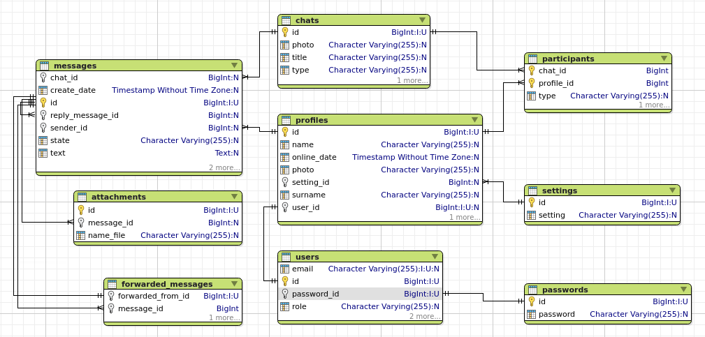

# MediaGate (CHAT)
#### MediaGate – это унифицированная система доступа к социальным медиа, разработанная для упрощения взаимодействия с различными платформами через единую точку входа. Приложение обеспечивает безопасную авторизацию, управление данными пользователей и интеграцию с популярными сервисами социальных сетей.

Приложение написано с использованием:
Java 17. В разработке использованы PostgreSQL, Hibernate ORM, Minio.

### Работа чата:


### Диаграмма:


```
docker run --name minio     --publish 9000:9000     --publish 9001:9001  --volume /home/olga/dev/data:/data   minio/minio:latest  server /data --console-address ":9001"
```

```
ng serve --proxy-config proxy.conf.ts
```

pg_restore -U postgres -d chat /tmp/your_dump.sql
дамп в бд докера